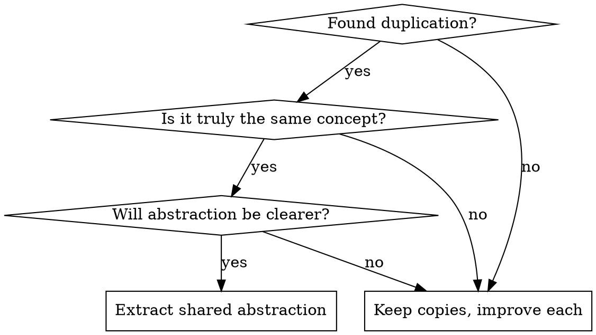

# Code Simplifier

## Overview

**Simplification means improving clarity, not reducing line count.**

Good simplification removes accidental complexity while keeping essential complexity explicit. Bad simplification hides complexity behind abstractions or premature generalizations.

## Core Principles



### What Simplification IS

- Removing dead code and unused variables
- Flattening unnecessary nesting
- Replacing complex conditionals with early returns
- Using standard library over custom implementations
- Making names clearer and more specific
- Removing redundant comments that just repeat code
- Fixing inconsistent formatting/style

### What Simplification is NOT

- Creating abstractions to reduce line count
- Adding interfaces "for flexibility"
- Extracting helpers for code used only once
- Creating generic solutions for specific problems
- Adding layers to "separate concerns"

## Quick Reference

| Smell | Good Fix | Bad Fix |
|-------|----------|---------|
| Similar code in 2-3 places | Improve each copy | Create shared helper |
| Long function | Extract meaningful sub-operations | Split arbitrarily by line count |
| Nested conditionals | Early returns, guard clauses | Move to separate functions |
| Magic values | Named constants | Config files or parameters |
| Complex expression | Intermediate variables with clear names | Helper function |

## The Simplification Checklist

**Before proposing ANY change, verify:**

1. **Does it preserve behavior?** - No functional changes
2. **Is it actually simpler to read?** - Not just fewer lines
3. **Does it follow project conventions?** - Check existing patterns
4. **Would a new team member understand it faster?** - The real test

## Red Flags - STOP and Reconsider

- "Let's create an interface for this"
- "We could make this generic"
- "This could be reused later"
- "Let's add a helper function"
- "We should abstract this pattern"
- "This violates DRY"

**All of these may be premature.** A little copying is better than a little dependency.

## Working with Recent Changes

When simplifying recent code changes:

1. **Get context first** - Read the recent commits to understand intent
2. **Check for project skills** - Does the project have style guides or patterns?
3. **Preserve the fix** - If code was changed to fix a bug, don't undo that
4. **Small, focused changes** - One simplification type at a time
5. **Verify nothing breaks** - Run tests after each change

## Example: Good vs Bad Simplification

### Bad: Extracting for line count

```go
// Before: Clear, explicit
if req.Role.RoleDefinitionID == "" {
    return ErrMissingRoleDefinitionID
}
if req.Scope == "" {
    return ErrMissingScope
}

// Bad "simplification": Hidden in helper
if err := validateRole(req.Role); err != nil {
    return err
}
```

The helper hides what's being validated. Reader must jump to another function.

### Good: Improving clarity in place

```go
// Before: Nested and hard to follow
func process(data []Item) error {
    if len(data) > 0 {
        for _, item := range data {
            if item.Valid {
                if err := handle(item); err != nil {
                    return err
                }
            }
        }
    }
    return nil
}

// After: Flat and clear
func process(data []Item) error {
    for _, item := range data {
        if !item.Valid {
            continue
        }
        if err := handle(item); err != nil {
            return err
        }
    }
    return nil
}
```

## Common Mistakes

| Mistake | Why It's Wrong | Better Approach |
|---------|---------------|-----------------|
| Extract every duplicate | Creates coupling, hides context | Tolerate 2-3 copies |
| Add interface for single impl | YAGNI, adds indirection | Wait for second impl |
| Refactor while fixing bugs | Mixes concerns, harder to review | Separate commits |
| Optimize prematurely | Wrong bottleneck, added complexity | Profile first |
